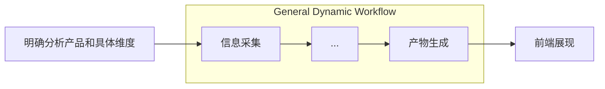
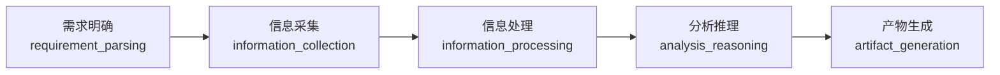

# PMax

**一个面向产品经理的可溯源、可观测的综合竞品分析系统。**

- 协助决策 - 明确分析对象、需求
- 多元信息搜集 - 产业政策支持、发展规划等背景信息；产品参数、功能等信息横向对比；
- 信息整合与分析 - 整合多元化的信息并执行分析
- 多元化产物 - 根据多样的分析需求产出多元化的结构化产物
- 全链路可溯源 - 全过程保留原始信息来源和活动记录，易于溯源、纠错、恢复
- 持久化信息数据库 - 自构建、迭代用户相关的产品信息、行业信息、发展动态等，便于演进分析

## 开发阶段与目标

- 当前：Phase 2

### Phase 1

- 目标：学习明确竞品分析业务场景、确认系统设计和技术栈选型、搭建 agent 基础设施骨架

- [x] 业务场景：明确常见竞品分析目标和相关产物、提取通用化工作流
- [x] 系统设计：
  - [x] 采用 Orchestrator 模式动态编排主要节点
  - [x] 具体节点业务能力解耦为可插拔 skills
  - [x] 构建健壮的事件总线
  - [x] 定义明确的节点事件类型
- [x] AI Infra：构建**分布式、可插拔的多节点运行时**

### Phase 2

- 目标：完整实现基础的“横向产品对比”功能的前后端完整分析流程闭环。

- [ ] 链路打通：打通对于**”横向产品对比“**这一分析需求的完整分析链路。
  - [x] 设计适用于该需求的 skills 和基本路由决策
  - [x] 设计基本的 agent 错误处理、重试和兜底策略
  - [x] 支持全链路中的人在回路决策机制

- [x] 后端搭建：
  - [x] 建立基本 API 端点路由
  - [x] 异常处理逻辑与兜底
  - [x] 数据、事件事务设计
- [ ] 前端搭建：设计子页面、组件样式与动画、不同事件 payload 对应的不同子组件（输出）

### Phase 3

- 目标：继续演进多样化分析需求的分析流程、加强并完善 agent 产物质量的评估机制、优化 P2 已知不足

## 竞品分析业务场景

**最通用的竞品分析目标有哪些？对应哪些种类的产物？**

| 目标                   | 说明                                                         | 常见结构化产物                         |
| ---------------------- | ------------------------------------------------------------ | -------------------------------------- |
| 产品横向对比           | 在已有产品之间进行特定维度（功能、定价等）的信息采集和横向对比 | 功能对比矩阵、SWOT 矩阵                |
| 产品发展决策           | 分析用户产品的差异化发展机会和竞争策略                       | 机会地图、定位声明、发展策略、具体路径 |
| 产业发展状态和趋势分析 | 分析PEST、产业链结构、市场规模与变化、竞争格局、用户对产业需求变化 | 对应的部分                             |
| [其他子分析目标]       |                                                              |                                        |

## 通用 Agentic Workflow 设计

当前设计 5 节点通用工作流：

计划用此工作流覆盖预设的 3 种主要分析业务场景，差异化由节点的不同 tools 补足。

### 需求明确 Requirement_parsing

### 信息采集 Information_collection

### 信息处理 Information_processing

### 分析推理 Analysis_reasoning

### 产物生成 Artifact_generation

