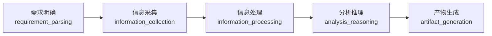

# DESIGN.md

这是本项目通用工作流和具体业务节点能力设计的描述文档。

## 通用 Agentic Workflow 设计

当前设计 5 节点通用工作流：



计划用此工作流覆盖预设的 3 种主要分析业务场景，差异化由节点的不同 tools 补足。

**架构原则：Capability 只做编排（循环、分支、并行、事件发射），所有具体工作（LLM 调用、数据转换、外部请求）必须通过 Tool.execute() 完成。**

---

### 需求明确 Requirement_parsing

#### 核心任务

通过多轮对话将用户模糊的自然语言输入引导到系统预设的 3 类分析场景之一（Phase 2 默认 `product_comparison`），逐步补全分析参数，直到用户确认产出结构化的 `RequirementConfig`。

#### 输入

用户初始 prompt（自然语言，如"我想看看我们和竞品比起来怎么样"）

#### 输出

```typescript
interface RequirementConfig {
  analysisType: "product_comparison";  // Phase 3 扩展为 discriminated union
  targets: Target[];                   // ≥ 2 个，第一个为用户自身产品（参照系）
  dimensions: Dimension[];             // ≥ 1 个
  outputFormat: OutputFormat[];        // ≥ 1 个
  constraints: AnalysisConstraints;
  userInput: string;
  clarificationHistory: ClarificationRound[];  // 完整对话溯源链
}

interface ClarificationRound {
  round: number;
  questionType: "scene_selection" | "targets" | "dimensions" | "output_format" | "constraints" | "confirm_preview";
  agentPrompt: string;            // 本轮 agent 向用户提出的问题/选项
  userResponse: string;           // 用户原始回答文本
  extractedDelta: Record<string, any>;  // 从本轮回答中提取的结构化增量
  timestamp: string;
}

interface Target {
  name: string;
  url?: string;       // 用户可选提供，不提供则由 information_collection 补全
  category?: string;
}

type Dimension =
  | "functionality"
  | "pricing"
  | "user_experience"
  | "market_position"
  | "technology"
  | string;

type OutputFormat = "comparison_matrix" | "swot" | "insight_report" | "report";

interface AnalysisConstraints {
  timeRange?: { from?: string; to?: string };
  regions?: string[];
  languages?: string[];
  maxCompetitors?: number;
}
```

#### Capability 工作流

这是一个多轮澄清循环，每轮暂停→等待用户输入→更新 config→进入下一轮，直到用户在最终确认轮明确同意。

```
Round 1: 分析场景定调
  Step A: agent 生成场景选项 prompt
  Step B: emit CLARIFICATION_ASKED { round: 1, questionType: "scene_selection", agentPrompt }
  Step C: HITL 暂停，等待用户选择
  Step D: emit CLARIFICATION_ANSWERED { round: 1, userResponse, extractedDelta: { analysisType } }
  判断用户意图是否匹配 3 种预设场景:
    - 若明确 → 确认并继续
    - 若模糊 → 列出 3 种场景让用户选择
    （Phase 2 默认 product_comparison，Phase 3 扩展 dev_decision / industry_trend）

Round 2: 竞品列表补全
  Step A: agent 提取已提及的产品名
  Step B: 若 < 2 个 → 追问"还缺少竞品，请补充"
          询问"你的自身产品是哪一个？"（标记为参照系，置于 targets[0]）
  Step C: emit CLARIFICATION_ASKED { round: 2, questionType: "targets", agentPrompt }
  Step D: HITL 暂停
  Step E: emit CLARIFICATION_ANSWERED { round: 2, userResponse, extractedDelta: { targets } }
  → tool: llm_structured_extract（从用户回答中提取产品名列表）

Round 3: 对比维度确认
  Step A: → tool: dimension_suggester（根据品类关键词推荐维度）
  Step B: agent 列出预设 5 维度 + 推测推荐，让用户勾选或自行输入
  Step C: emit CLARIFICATION_ASKED { round: 3, questionType: "dimensions", agentPrompt }
  Step D: HITL 暂停
  Step E: emit CLARIFICATION_ANSWERED { round: 3, userResponse, extractedDelta: { dimensions } }
  → tool: llm_structured_extract

Round 4: 产物格式确认
  Step A: agent 列出可用产物类型及其适用场景
            - comparison_matrix: 属性级对比表格
            - swot: 各竞品 SWOT 分析
            - insight_report: 差异化洞察报告（差距/优势/机会/风险）
            - report: 完整分析报告（含以上全部 + 数据来源附录）
  Step B: emit CLARIFICATION_ASKED { round: 4, questionType: "output_format", agentPrompt }
  Step C: HITL 暂停
  Step D: emit CLARIFICATION_ANSWERED { round: 4, userResponse, extractedDelta: { outputFormat } }
  → tool: llm_structured_extract

Round 5: 约束条件确认（用户可跳过）
  Step A: agent 询问时间范围、地域、语言偏好
  Step B: emit CLARIFICATION_ASKED { round: 5, questionType: "constraints", agentPrompt }
  Step C: HITL 暂停（含跳过按钮）
  Step D: emit CLARIFICATION_ANSWERED { round: 5, userResponse, extractedDelta: { constraints } }
  → tool: llm_structured_extract

Round 6: 最终确认预览
  Step A: agent 展示完整的结构化 config 预览
  Step B: emit CLARIFICATION_ASKED { round: 6, questionType: "confirm_preview", agentPrompt }
  Step C: HITL 暂停
  分支:
    - 用户确认 → 写入 state.data.config（含完整 clarificationHistory）→ 节点完成
    - 用户修改 → 回到对应轮次重新提问
  Step D: emit NODE_COMPLETED { summary, config }
```

**退出条件：用户在 Round 6 明确点击"确认"。**

**溯源设计：** 每轮对话的 `CLARIFICATION_ASKED` 和 `CLARIFICATION_ANSWERED` 事件携带独立 `traceId`，`clarificationHistory` 完整保留每轮的 agent prompt 和 user prompt，config 中的任何参数均可回溯到具体第几轮、用户说了什么而确定。

#### 持有和建议调用的 Tools

| Tool | 类型 | 用途 | Round |
|------|------|------|-------|
| llm_structured_extract | LLM 工厂 | 从用户每轮回答中提取增量结构化信息 | 2-5 |
| dimension_suggester | LLM 工厂 | 根据品类关键词推荐对比维度 | 3 |

**不包含搜索/爬取 Tool。URL 的获取是 information_collection 的职责。**

---

### 信息采集 Information_collection

#### 核心任务

基于已确认的 `RequirementConfig`，对每个竞品×维度组合执行多源信息采集，获取可溯源的原始数据。内部包含：竞品官方 URL 发现 → 搜索计划生成 → 关键词搜索 → 关键页面全文抓取 → 可信度评估 → 充分性自检循环。

#### 输入

```typescript
config: RequirementConfig  // 来自 requirement_parsing
```

#### 输出

```typescript
rawData: Record<string, RawDataItem[]>

RawDataItem {
  target: string;
  dimension: string;
  content: string;           // 全文内容（scrape 后替换 snippet）
  sourceUrl: string;
  sourceTitle?: string;
  retrievedAt: string;
  credibility: "high" | "medium" | "low" | "unknown";
}

CollectionReport {
  totalItems: number;
  perDimension: { [dim: string]: { count: number; credibilityBreakdown: Record<string, number> } };
  sufficiencyScore: number;         // 1-5
  sufficiencyVerdict: "sufficient" | "insufficient";
  collectionRounds: number;         // 执行的采集轮次
}
```

#### Capability 工作流

```
Step 1: 竞品 URL 发现
  → tool: competitor_url_resolver
  对每个 target，搜索其官方网站/应用商店/主要信息页面
  输入: target.name, target.category
  输出: target.url 被补全（若用户未提供）
  策略:
    - 官网优先（品牌名 + 官网）
    - 应用商店次之（App Store / Google Play 页面）
    - 知名评测/数据库（G2/Capterra 等，视品类而定）
  每发现一个 URL → emit TOOL_RESULT { result.url, sourceTraceId }

Step 2: 搜索计划生成
  → tool: search_planner
  输入: targets（含已补全的 url）, dimensions, constraints
  输出: SearchPlan { batches: [{ queries: [{ target, dimension, query, searchType }] }] }
  规则:
    - searchType = "broad"（泛搜索词）| "targeted"（定向官网特定页面）
    - 定价维度 → searchType: "targeted"，query 指向官网 /pricing 路径
    - 功能维度 → searchType: "broad"，query 含产品名 + 功能对比/评测关键词
    - UX 维度   → searchType: "broad"，query 含产品名 + 用户体验/评价关键词
    - 同一 batch 内 queries 无数据依赖，可并行
    - batch 间无强制依赖，但建议优先执行 targeted 类型的 batch
    - constraints.timeRange 影响搜索词（如加 "2025" 或 "最新"）

Step 3: 按 batch 执行搜索与抓取
  外层串行（batch 间），内层并行（batch 内）
  对每个 query:
    a) 搜索
       → tool: web_search
       输入: query, maxResults=3
       输出: [{ title, url, snippet }]
    b) 选 Top-2 URL，全文抓取
       → tool: web_scrape
       输入: url
       输出: { title, content, excerpt, siteName }
       超时 10s，失败标记 scrape_failed 不阻塞其他
    c) 组装 RawDataItem
       content = scraped 全文（非 snippet）
       sourceUrl = 原始 URL
       sourceTitle = 抓取标题
       retrievedAt = ISO 时间戳
  事件流: TOOL_CALL → TOOL_RESULT（每次 Tool 调用前后各一次）
  所有 RawDataItem 记录 sourceTraceId 到 emit 事件中

Step 4: 可信度评估
  → tool: credibility_scorer
  对每条 RawDataItem 评分:
    来源: 官网/应用商店 = high, 知名媒体 = medium, 论坛/UGC/blog = low
    时效: 6 个月内 = high, 1 年内 = medium, 超过 1 年 = low
    内容量: < 200 字符降一级
  更新 RawDataItem.credibility
  emit QUALITY_REPORT { perItem: [{ sourceUrl, credibility, reason }] }

Step 5: 充分性检查
  → tool: sufficiency_checker
  输入: rawData, config.dimensions
  评估标准:
    - 每个 dimension 至少 3 条 high-credibility 来源
    - 至少覆盖 80% 的 (target × dimension) 组合
    - 定价维度至少 1 条官方来源
  输出: { score: 1-5, verdict, perDimension: { coverage, missingTargets }, suggestions }
  分支判断:
    - score >= 4  → 通过，进入 Step 6
    - score >= 3  → emit QUALITY_WARNING（含具体不足项），进入 Step 6（可被 Orchestrator 回跳）
    - score < 3   → 返回 Step 2 生成补充搜索计划（最多 2 轮，避免死循环）
                    第 2 轮时放宽标准：score >= 3 即通过

Step 6: 按维度分组写入
  → capability 自身逻辑（非 Tool）
  将 rawData 按 dimension 分组:
    rawData["pricing"] = [...]
    rawData["functionality"] = [...]
    ...
  写入 state.data.rawData
  emit NODE_COMPLETED { CollectionReport }
```

#### 持有和建议调用的 Tools

| Tool | 类型 | 用途 | Step |
|------|------|------|------|
| competitor_url_resolver | LLM 工厂 | 补全 target 的官方 URL | 1 |
| search_planner | LLM 工厂 | 将 targets×dimensions 分解为搜索计划 | 2 |
| web_search | 纯函数 | DDG 关键词搜索 | 3 |
| web_scrape | 纯函数 | JSDOM+Readability 全文抓取 | 3 |
| credibility_scorer | 规则+LLM | 域名+时效+内容量评分 | 4 |
| sufficiency_checker | LLM 工厂 | 覆盖度评估+补充建议 | 5 |

---

### 信息处理 Information_processing

#### 核心任务

将 `rawData` 中的原始非结构化文本清洗、去重、归一化，转化为属性级别的结构化可对比记录。不做任何分析推理——只做"原文有什么"的提取和整理。

#### 输入

```typescript
rawData: Record<string, RawDataItem[]>
config: RequirementConfig
```

#### 输出

```typescript
structuredData: Record<string, StructuredRecord[]>

StructuredRecord {
  target: string;
  dimension: string;
  attribute: string;          // 归一化属性名，如 "月费价格"
  value: string;              // 归一化值，如 "¥99/月"
  rawValue?: string;          // 原始文本值（溯源用）
  confidence: number;         // 0-1 LLM 提取置信度
  sourceTraceIds: string[];   // 回溯到 rawData 的 traceId 列表
  status: "clean" | "conflicting" | "inferred";
}

ProcessingResult {
  records: StructuredRecord[];
  coverageMatrix: { [target: string]: { [dimension: string]: "covered" | "inferred" | "missing" } };
  conflictCount: number;
}
```

#### Capability 工作流

```
Step 1: 按维度路由提取策略
  → capability 自身逻辑（非 Tool）
  根据 config.dimensions 中的每个 dimension 选择提取 Tool:
    - "pricing"          → pricing_normalizer（价格归一化专用）
    - "functionality"    → feature_extractor（功能点拆分专用）
    - "user_experience"  → feature_extractor（通用属性提取）
    - "market_position"  → feature_extractor
    - "technology"       → feature_extractor
  不匹配预设 → feature_extractor（通用 fallback）

Step 2: 逐(target, dimension)提取结构化记录
  对每个 (target, dimension) 组合:
    a) 从 rawData[dimension] 中筛选属于该 target 的 RawDataItem[]
    b) 若为空 → 标记 coverageMatrix[target][dimension] = "missing"，跳过
    c) 拼接所有 item.content 为 rawContent（若超过 8000 字符则截断）
    d) 调用对应提取 Tool
       输入: { target, dimension, rawContent, items }
       输出: { records: [{ attribute, value, confidence, rawValue }] }
    e) 每条 record 附加对应 items 的 traceId 到 sourceTraceIds
    f) 过滤 confidence < 0.5 的 record
    g) emit TOOL_CALL / TOOL_RESULT

Step 3: 实体对齐（同义属性合并）
  → tool: entity_resolver
  在同一 dimension 内，将语义相同的 attribute 合并:
    输入: 同一 dimension 下所有 StructuredRecord[]
    示例: "免广告" / "无广告" / "ad-free" / "No Ads" → 合并为 "免广告"
    保留最高 confidence 的值，合并所有 sourceTraceIds
    输出: { merged: StructuredRecord[] }
  emit TOOL_CALL / TOOL_RESULT

Step 4: 冲突检测
  → tool: conflict_detector
  检测同一 (target, attribute) 的多个来源是否矛盾:
    输入: 合并后的 StructuredRecord[]
    示例: 来源 A 说 "免费"，来源 B 说 "月费 ¥99"
    标记 status: "conflicting"，记录 conflictDetails
    无冲突 → status: "clean"
    仅有低置信度来源 → status: "inferred"
    输出: { records: StructuredRecord[], conflicts: ConflictReport[] }

Step 5: 覆盖矩阵生成
  → capability 自身逻辑（非 Tool）
  遍历所有 (target × dimension) 组合:
    - 有 ≥1 条 clean 记录     → "covered"
    - 只有 conflicting/inferred → "inferred"
    - 无任何记录               → "missing"
  生成 coverageMatrix
  emit NODE_COMPLETED { ProcessingResult }
```

#### 持有和建议调用的 Tools

| Tool | 类型 | 用途 | Step |
|------|------|------|------|
| pricing_normalizer | LLM 工厂 | 定价维度：统一货币/计费周期/提取价格属性 | 2 |
| feature_extractor | LLM 工厂 | 功能及其他维度：拆分为原子属性点 | 2 |
| entity_resolver | LLM 工厂 | 同义属性语义合并 | 3 |
| conflict_detector | 规则+LLM | 检测矛盾声明，标记冲突状态 | 4 |

---

### 分析推理 Analysis_reasoning

#### 核心任务

基于已清洗的结构化数据执行多维度对比分析。以用户自身产品为参照系，产出对比矩阵、SWOT 分析、差异化洞察和综合摘要。所有结论必须附带置信度标注和数据来源引用。

#### 输入

```typescript
config: RequirementConfig
structuredData: Record<string, StructuredRecord[]>  // 优先使用
rawData: Record<string, RawDataItem[]>               // 降级使用（structuredData 缺失时）
```

#### 输出

```typescript
AnalysisResult {
  comparisonMatrix: FeatureComparison[];
  swot: SWOTEntry[];
  insights: Insight[];
  summary: string;
}

FeatureComparison {
  dimension: string;
  attribute: string;
  values: { target: string; value: string; sourceTraceId: string }[];
  winner?: string;
  confidence: "high" | "medium" | "low";  // 从 StructuredRecord.confidence 传播
  analysis: string;                        // LLM 差异分析（一句话）
}

SWOTEntry {
  category: "strengths" | "weaknesses" | "opportunities" | "threats";
  target: string;
  point: string;
  evidence: string;           // 必须引用具体数据
  sourceTraceIds: string[];
  confidence: "high" | "medium" | "low";
}

Insight {
  category: "gap" | "opportunity" | "risk" | "advantage";
  statement: string;          // "你的产品在定价维度显著高于竞品 A 和 B"
  evidence: string;           // 支撑数据
  relatedTargets: string[];   // 涉及的竞品
  sourceTraceIds: string[];
}

AnalysisReport {
  conclusionCount: number;
  overallConfidence: "high" | "medium" | "low";  // 所有结论置信度的加权平均
  imbalanceWarnings?: string[];                   // 数据不均衡告警
}
```

#### Capability 工作流

```
Step 0: 数据质量预检
  → capability 自身逻辑（非 Tool）
  a) 数据不平衡检测:
     统计每个 target 的 StructuredRecord 总数
     若 max/min > 2x → 记录 imbalanceWarning
     emit DATA_IMBALANCE_WARNING（信息性，不阻塞流程）
  b) 冲突汇总:
     读取 processingResult.conflictCount
     若 > 总量的 20% → 后续所有结论 confidence 下调一级
  c) 数据降级检查:
     若 structuredData 的 coverageMatrix 中 > 50% 为 "missing" → 降级使用 rawData
     使用 rawData 进行分析时，所有 conclusion.confidence 最高为 "medium"

Step 1: 对比矩阵生成
  → tool: matrix_builder
  输入:
    - targets: config.targets（含参照系标记）
    - dimensions: config.dimensions
    - data: structuredData JSON（或降级 rawData JSON）
    - coverageContext: coverageMatrix（让 LLM 知道哪些结论数据不足）
    - imbalanceWarnings（若存在）
  输出: { comparisonMatrix: FeatureComparison[] }
  规则:
    - 每行一个属性，每列一个竞品
    - 标记 winner（无明显差异则为 null）
    - 每行附带 confidence（从 StructuredRecord.confidence 传播）
    - analysis 字段指出差异原因
    - 无数据的单元格 value = "无数据"，confidence = "low"
  emit TOOL_CALL / TOOL_RESULT

Step 2: SWOT 并行生成
  → tool: swot_generator
  对每个 target 并行执行（Promise.allSettled）:
    输入: { target, data, comparisonContext: matrix 摘要 }
    输出: { swot: SWOTEntry[] }
  规则:
    - S/W 基于产品自身对比数据（功能、定价、体验等），evidence 必须引用具体对比数据
    - O/T 基于外部环境推断（市场趋势、差异化机会、威胁），evidence 引用行业信息
    - 每类 2-5 条
    - sourceTraceIds 不能为空
    - confidence 根据支撑数据的 credibility 传播
  所有 target 完成后 → emit TOOL_CALL / TOOL_RESULT

Step 3: 差异化洞察提取
  → tool: insight_extractor
  以 config.targets 中的第一个（用户自身产品）为参照系:
    输入: { comparisonMatrix, swot, ownProduct: targets[0], imbalanceWarnings }
    输出: { insights: Insight[] }
  洞察分类:
    - "gap":        自身产品在某维度显著弱于竞品
    - "advantage":  自身产品在某维度显著优于竞品
    - "opportunity": 所有竞品均未充分覆盖的维度（蓝海）
    - "risk":       竞品在某维度快速追赶或已接近
  每条 insight 含 evidence（引用对比数据中的具体数值）
  emit TOOL_CALL / TOOL_RESULT

Step 4: 综合摘要生成
  → tool: comparison_summarizer
  输入: { targets, matrixSummary, swotSummary, insights, imbalanceWarnings }
  输出: { summary: string }  // ≤ 500 字
  涵盖:
    1. 整体竞争格局概述
    2. 各竞品的核心差异化优势
    3. 自身产品的关键差距和机会
    4. 值得关注的趋势或风险（如有数据不均衡则注明）
  emit TOOL_CALL / TOOL_RESULT

Step 5: 汇总写入
  → capability 自身逻辑（非 Tool）
  组装 AnalysisResult + AnalysisReport
  写入 state.data.analysisResults
  emit NODE_COMPLETED { report }
```

#### 持有和建议调用的 Tools

| Tool | 类型 | 用途 | Step |
|------|------|------|------|
| matrix_builder | LLM 工厂 | 多维度对比矩阵生成 | 1 |
| swot_generator | LLM 工厂 | 每竞品 SWOT 分析 | 2 |
| insight_extractor | LLM 工厂 | 以自身产品为参照系的差异化洞察 | 3 |
| comparison_summarizer | LLM 工厂 | 综合分析摘要 | 4 |

---

### 产物生成 Artifact_generation

#### 核心任务

将分析结果格式化为可交付产物，嵌入完整溯源链。这是工作流的终止节点——执行完成后 emit `WORKFLOW_COMPLETE`，编排循环结束。

#### 输入

```typescript
config: RequirementConfig
analysisResults: AnalysisResult
rawData: Record<string, RawDataItem[]>       // 用于构建 sourceMap
structuredData: Record<string, StructuredRecord[]>
```

#### 输出

```typescript
artifacts: Artifact[]

Artifact {
  type: "comparison_matrix" | "swot" | "insight_report" | "report" | "summary";
  format: "markdown" | "html";
  title: string;
  content: string;                // 渲染后的正文
  sourceMap: SourceMapEntry[];    // 溯源映射
}

SourceMapEntry {
  conclusionFragment: string;     // 产物中的结论片段
  sourceUrl: string;              // 原始来源 URL
  sourceExcerpt: string;          // 来源原文摘录（≤200 字符）
  traceId: string;                // 回溯到 WorkflowEvent
  credibility: "high" | "medium" | "low" | "unknown";
}
```

#### Capability 工作流

```
Step 1: 溯源链构建
  → tool: source_map_builder
  输入: analysisResults, rawData, structuredData
  对 analysisResults 中的每个结论（矩阵单元格、SWOT 条目、insight）:
    a) 通过 sourceTraceIds → StructuredRecord → RawDataItem 回溯到原始 URL
    b) 截取 sourceExcerpt（≤200 字符的原文引用）
    c) 标记 credibility（从 RawDataItem.credibility 传播）
    d) 不可回溯的标记为 { traceId: "unavailable" }
  输出: { sourceMap: SourceMapEntry[] }
  emit TOOL_CALL / TOOL_RESULT

Step 2: 按 outputFormat 路由产物生成
  → capability 自身逻辑（非 Tool）
  遍历 config.outputFormat，对每种格式执行对应的渲染路径

Step 2a: 对比矩阵表格渲染
  → tool: table_composer  （仅在 outputFormat 含 "comparison_matrix" 时）
  输入:
    - title: "产品对比矩阵"
    - targets
    - rows: FeatureComparison[] 转换的 { attribute, values: { target: value } }[]
    - highlights: winner 标记（高亮优胜单元格）
    - sourceMap: 每条表格数据附带的 sourceMapEntry 引用
  输出: Markdown 或 HTML 表格（根据 config.outputFormat 中的声明）
  生成 Artifact { type: "comparison_matrix", ... }

Step 2b: SWOT 逐竞品渲染
  → capability 自身逻辑（非 Tool）  （仅在 outputFormat 含 "swot" 时）
  对每个 target:
    组装 Markdown:
      ## {target} SWOT 分析
      ### 优势 (Strengths)  — 条目列表，每条附置信度标记
      ### 劣势 (Weaknesses) — 同上
      ### 机会 (Opportunities) — 同上
      ### 威胁 (Threats)       — 同上
    生成 Artifact { type: "swot", ... }

Step 2c: 差异化洞察报告渲染
  → capability 自身逻辑（非 Tool）  （仅在 outputFormat 含 "insight_report" 时）
  组装 Markdown:
    ## 差异化洞察
    ### 差距分析 — gap 类 insight 列表
    ### 自身优势 — advantage 类 insight 列表
    ### 蓝海机会 — opportunity 类 insight 列表
    ### 风险预警 — risk 类 insight 列表
  生成 Artifact { type: "insight_report", ... }

Step 2d: 综合报告渲染
  → tool: markdown_renderer  （仅在 outputFormat 含 "report" 时）
  输入:
    - title: "竞品分析报告 — {首个 target.name} vs {其他 targets}"
    - sections: [
        { heading: "分析概览", content: analysisResults.summary },
        { heading: "对比矩阵", content: table_composer 输出 },
        { heading: "SWOT 分析",  content: 各竞品 SWOT 的聚合 },
        { heading: "差异化洞察", content: insight 分类列表 },
        { heading: "数据来源",   content: sourceMap 汇总（URL + credibility + 摘录） }
      ]
    - 每 section 附带对应的 sourceMap 子集
  输出: 完整 Markdown 报告
  生成 Artifact { type: "report", ... }

Step 3: 终止
  → capability 自身逻辑（非 Tool）
  emit WORKFLOW_COMPLETE {
    artifactCount,
    sourceMapCount,
    overallConfidence: 从 AnalysisReport 传播
  }
  编排循环收到 WORKFLOW_COMPLETE 后终止 while 循环
```

#### 持有和建议调用的 Tools

| Tool | 类型 | 用途 | Step |
|------|------|------|------|
| source_map_builder | 规则+LLM | 结论→原始 URL 溯源链构建 | 1 |
| table_composer | 纯函数 | 对比矩阵 Markdown/HTML 表格渲染 | 2a |
| markdown_renderer | 纯函数 | 完整报告 Markdown 组装 | 2d |

---

## 总览

### Capability 与 Tool 矩阵

```
requirement_parsing
  └─ Tools: llm_structured_extract, dimension_suggester
  └─ 职责: 6 轮对话澄清 → 用户确认 → config（含 clarificationHistory）

information_collection
  └─ Tools: competitor_url_resolver, search_planner, web_search, web_scrape,
            credibility_scorer, sufficiency_checker
  └─ 职责: URL 发现 → 搜索计划 → 搜索+抓取 → 可信度 → 充分性自检循环 → rawData

information_processing
  └─ Tools: pricing_normalizer, feature_extractor, entity_resolver, conflict_detector
  └─ 职责: 按维度路由提取 → 结构化 → 实体对齐 → 冲突检测 → structuredData + coverageMatrix

analysis_reasoning
  └─ Tools: matrix_builder, swot_generator, insight_extractor, comparison_summarizer
  └─ 职责: 数据预检 → 对比矩阵 → SWOT → 差异化洞察 → 摘要 → analysisResults

artifact_generation
  └─ Tools: source_map_builder, table_composer, markdown_renderer
  └─ 职责: 溯源链构建 → 按 outputFormat 路由渲染 → WORKFLOW_COMPLETE
```

### Tool 实现状态

**已有且已接入（5 个）：** llm_structured_extract, web_search, matrix_builder, swot_generator, table_composer

**已有但未接入（4 个）：** web_scrape, feature_extractor, pricing_normalizer, markdown_renderer

**需新增（10 个）：** dimension_suggester, competitor_url_resolver, search_planner, credibility_scorer, sufficiency_checker, entity_resolver, conflict_detector, insight_extractor, source_map_builder, comparison_summarizer

**总计：17 个 Tool**（5 已接入 + 4 待接入 + 10 新增）
